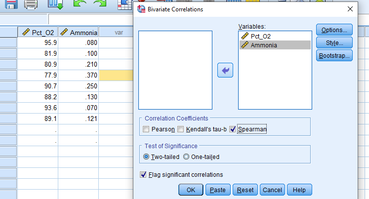

Aim
================================================================================

The aim of this lecture is to introduce the concepts of correlation and regression. We will focus first on what it means for two variables to be correlated, how to measure correlation, what to do when our two variables of interest are not normally distributed, and how to test whether or not a correlation is statistically significant in SPSS. We will then look at simple linear regression (as opposed to multiple linear regression), the terminology of linear regression, the assumptions of linear regression, and how to run a regression analysis in SPSS. 


Correlation
================================================================================

It is often important to investigate the relationship between pairs of variables. For example, researchers might want to understand how the following pairs of variables are related:

- Vegetation height and mean annual temperature
- Animal body size and metabolic rate
- Number of automobiles in a location and carbon emissions

The correlation between pairs of variables, such as those listed above, describes how the variation of each variable is related to the other variable. This is formalised with a single value called the correlation coefficient, which provides a statistical measure of the strength and direction of the association between two variables. Note that the correlation coefficient only describes the association between two variables; it does not, by itself, reveal anything about the nature of cause and effect.

The easiest way to understand the correlation coefficient by visualising a scatterplot of two variables. The plots below show a sample of data collected from two hypothetical variables, X and Y (Figure 1). The left plot illustrates what it looks like when X and Y are negatively correlated, and the right plot illustrates what it looks like when X and Y are positively correlated.

```{r, echo = FALSE, message = FALSE, warning = FALSE, fig.cap= "Two plots of hypothetical variables illustrating a positive (left) and negative correlation"}
rho1 <- 0.9;
Z1   <- rnorm(n = 16, mean = 0, sd = 1);
Z2   <- rnorm(n = 16, mean = 0, sd = 1);
X1   <- Z1 + 10;
Y1   <- rho1 * Z1 + sqrt(1 - rho1*rho1) * Z2 + 10;
par(mfrow = c(1, 2), mar = c(5, 2, 1, 0.5));
plot(x = X1, y = Y1, pch = 20, xlab = "X value", ylab = "Y value", cex = 1.5,
     xlim = c(7, 13), ylim = c(7, 13), xaxt = "n", yaxt = "n", cex.lab = 1.25,
     line = 1);
rho1 <- -0.9;
Z1   <- rnorm(n = 16, mean = 0, sd = 1);
Z2   <- rnorm(n = 16, mean = 0, sd = 1);
X1   <- Z1 + 10;
Y1   <- rho1 * Z1 + sqrt(1 - rho1*rho1) * Z2 + 10;
plot(x = X1, y = Y1, pch = 20, xlab = "X value", cex = 1.5, line = 1, 
     xlim = c(7, 13), ylim = c(7, 13), xaxt = "n", yaxt = "n", cex.lab = 1.25,
     ylab = "Y value");
# png(filename = "img/pos_neg_cor.png");
# rho1 <- 0.9;
# Z1   <- rnorm(n = 16, mean = 0, sd = 1);
# Z2   <- rnorm(n = 16, mean = 0, sd = 1);
# X1   <- Z1 + 10;
# Y1   <- rho1 * Z1 + sqrt(1 - rho1*rho1) * Z2 + 10;
# par(mfrow = c(1, 2), mar = c(5, 2, 1, 0.5));
# plot(x = X1, y = Y1, pch = 20, xlab = "X value", ylab = "Y value", cex = 1.5,
#      xlim = c(7, 13), ylim = c(7, 13), xaxt = "n", yaxt = "n", cex.lab = 1.25,
#      line = 1);
# rho1 <- -0.9;
# Z1   <- rnorm(n = 16, mean = 0, sd = 1);
# Z2   <- rnorm(n = 16, mean = 0, sd = 1);
# X1   <- Z1 + 10;
# Y1   <- rho1 * Z1 + sqrt(1 - rho1*rho1) * Z2 + 10;
# plot(x = X1, y = Y1, pch = 20, xlab = "X value", cex = 1.5, line = 1, 
#      xlim = c(7, 13), ylim = c(7, 13), xaxt = "n", yaxt = "n", cex.lab = 1.25,
#      ylab = "Y value");
# dev.off();
```


Notice that in the left plot, where X and Y are positively correlated, if you know that one of the values is high, then you can be reasonably confident that the other variable will also be high (or if one value is low, then the other will be too). In the plot on the right, where X and Y are negatively correlated, if you know that one of the values is high, then you can be reasonably confident that the other value will be low. In both plots, the variables X and Y **covary**; that is, the values vary in a predictable way. Compare this to the plot below where X and Y do not covary at all. In the figure below (Figure 2), knowing something about the value of X does not provide any information about what the value of Y is likely to be. 

```{r, echo = FALSE, message = FALSE, warning = FALSE, fig.cap = "A plot of two hypothetical variables that are not correlated."}
X1 <- rnorm(n = 24, mean = 0, sd = 1);
Y1 <- rnorm(n = 24, mean = 0, sd = 1);
while(abs(cor(X1, Y1)) > 0.002){
  X1 <- rnorm(n = 24, mean = 0, sd = 1);
  Y1 <- rnorm(n = 24, mean = 0, sd = 1);
}
plot(x = X1, y = Y1, pch = 20, xlab = "X value", cex = 1.5, xlim = c(-3, 3),
     ylim = c(-3, 3), xaxt = "n", yaxt = "n", cex.lab = 1.25, ylab = "Y value",
     line = 1);
# png(filename = "img/no_cor.png");
# plot(x = X1, y = Y1, pch = 20, xlab = "X value", cex = 1.5, xlim = c(-3, 3),
#      ylim = c(-3, 3), xaxt = "n", yaxt = "n", cex.lab = 1.25, ylab = "Y value",
#      line = 1);
# dev.off();
```


The idea of correlation is formalised in a value called the **correlation coefficient**. This value can range from -1 to 1. Negative numbers indicate a negative correlation, positive numbers indicate a positive correlation, and a value of zero indicates no correlation. A correlation coefficient that is calculated from a sample of data is typically represented by a lower case $r$ (sometimes written as $r_{xy}$ to indicate that the correlation between $x$ and $y$ variables). The plots below show some hypothetical examples of data with different correlation coefficients.


```{r, echo = FALSE, message = FALSE, warning = FALSE, fig.cap = "Plots showing data with different correlation coefficients.", fig.height = 8}
par(mfrow = c(4, 2), mar = c(0, 0, 0, 0), oma = c(3, 3, 1, 1));
X1 <- rnorm(n = 24, mean = 0, sd = 1);
Y1 <- rnorm(n = 24, mean = 0, sd = 1);
while(cor(X1, Y1) < 0.199 | cor(X1, Y1) > 0.201){
  X1 <- rnorm(n = 24, mean = 0, sd = 1);
  Y1 <- rnorm(n = 24, mean = 0, sd = 1);
}
plot(x = X1, y = Y1, pch = 20, xlab = "X value", cex = 1.5, xlim = c(-3, 3),
     ylim = c(-3, 3), xaxt = "n", yaxt = "n", cex.lab = 1.25, ylab = "Y value",
     line = 1);
text(x = -2.2, y = 2.75, labels = "r = 0.2", cex = 2, hjust = 0);
X1 <- rnorm(n = 24, mean = 0, sd = 1);
Y1 <- rnorm(n = 24, mean = 0, sd = 1);
while(cor(X1, Y1) > -0.199 | cor(X1, Y1) < -0.201){
  X1 <- rnorm(n = 24, mean = 0, sd = 1);
  Y1 <- rnorm(n = 24, mean = 0, sd = 1);
}
plot(x = X1, y = Y1, pch = 20, xlab = "X value", cex = 1.5, xlim = c(-3, 3),
     ylim = c(-3, 3), xaxt = "n", yaxt = "n", cex.lab = 1.25, ylab = "Y value",
     line = 1);
text(x = -2.1, y = 2.75, labels = "r = -0.2", cex = 2, hjust = 0);
## Row 2
X1 <- rnorm(n = 24, mean = 0, sd = 1);
Y1 <- rnorm(n = 24, mean = 0, sd = 1);
while(cor(X1, Y1) < 0.399 | cor(X1, Y1) > 0.401){
  X1 <- rnorm(n = 24, mean = 0, sd = 1);
  Y1 <- rnorm(n = 24, mean = 0, sd = 1);
}
plot(x = X1, y = Y1, pch = 20, xlab = "X value", cex = 1.5, xlim = c(-3, 3),
     ylim = c(-3, 3), xaxt = "n", yaxt = "n", cex.lab = 1.25, ylab = "Y value",
     line = 1);
text(x = -2.2, y = 2.75, labels = "r = 0.4", cex = 2, hjust = 0);
X1 <- rnorm(n = 24, mean = 0, sd = 1);
Y1 <- rnorm(n = 24, mean = 0, sd = 1);
while(cor(X1, Y1) > -0.399 | cor(X1, Y1) < -0.401){
  X1 <- rnorm(n = 24, mean = 0, sd = 1);
  Y1 <- rnorm(n = 24, mean = 0, sd = 1);
}
plot(x = X1, y = Y1, pch = 20, xlab = "X value", cex = 1.5, xlim = c(-3, 3),
     ylim = c(-3, 3), xaxt = "n", yaxt = "n", cex.lab = 1.25, ylab = "Y value",
     line = 1);
text(x = -2.1, y = 2.75, labels = "r = -0.4", cex = 2, hjust = 0);
## Row 3
X1 <- rnorm(n = 24, mean = 0, sd = 1);
Y1 <- rnorm(n = 24, mean = 0, sd = 1);
while(cor(X1, Y1) < 0.699 | cor(X1, Y1) > 0.701){
  X1 <- rnorm(n = 24, mean = 0, sd = 1);
  Y1 <- rnorm(n = 24, mean = 0, sd = 1);
}
plot(x = X1, y = Y1, pch = 20, xlab = "X value", cex = 1.5, xlim = c(-3, 3),
     ylim = c(-3, 3), xaxt = "n", yaxt = "n", cex.lab = 1.25, ylab = "Y value",
     line = 1);
text(x = -2.2, y = 2.75, labels = "r = 0.7", cex = 2, hjust = 0);
X1 <- rnorm(n = 24, mean = 0, sd = 1);
Y1 <- rnorm(n = 24, mean = 0, sd = 1);
while(cor(X1, Y1) > -0.699 | cor(X1, Y1) < -0.701){
  X1 <- rnorm(n = 24, mean = 0, sd = 1);
  Y1 <- rnorm(n = 24, mean = 0, sd = 1);
}
plot(x = X1, y = Y1, pch = 20, xlab = "X value", cex = 1.5, xlim = c(-3, 3),
     ylim = c(-3, 3), xaxt = "n", yaxt = "n", cex.lab = 1.25, ylab = "Y value",
     line = 1);
text(x = -2.1, y = 2.75, labels = "r = -0.7", cex = 2, hjust = 0);
## Row 2
X1 <- rnorm(n = 24, mean = 0, sd = 1);
Y1 <- -1 * X1;
plot(x = X1, y = Y1, pch = 20, xlab = "X value", cex = 1.5, xlim = c(-3, 3),
     ylim = c(-3, 3), xaxt = "n", yaxt = "n", cex.lab = 1.25, ylab = "Y value",
     line = 1);
text(x = -2.2, y = 2.75, labels = "r = 1.0", cex = 2, hjust = 0);
X1 <- rnorm(n = 24, mean = 0, sd = 1);
Y1 <- X1;
plot(x = X1, y = Y1, pch = 20, xlab = "X value", cex = 1.5, xlim = c(-3, 3),
     ylim = c(-3, 3), xaxt = "n", yaxt = "n", cex.lab = 1.25, ylab = "Y value",
     line = 1);
text(x = -2.1, y = 2.75, labels = "r = -1.0", cex = 2, hjust = 0);
mtext(text="X value",side=1,line=1,outer=TRUE, cex = 1.5);
mtext(text="Y value",side=2,line=1,outer=TRUE, cex = 1.5);

# # Save the above
# png(filename = "img/cor_eg.png")
# par(mfrow = c(4, 2), mar = c(0, 0, 0, 0), oma = c(3, 3, 1, 1));
# X1 <- rnorm(n = 24, mean = 0, sd = 1);
# Y1 <- rnorm(n = 24, mean = 0, sd = 1);
# while(cor(X1, Y1) < 0.199 | cor(X1, Y1) > 0.201){
#   X1 <- rnorm(n = 24, mean = 0, sd = 1);
#   Y1 <- rnorm(n = 24, mean = 0, sd = 1);
# }
# plot(x = X1, y = Y1, pch = 20, xlab = "X value", cex = 1.5, xlim = c(-3, 3),
#      ylim = c(-3, 3), xaxt = "n", yaxt = "n", cex.lab = 1.25, ylab = "Y value",
#      line = 1);
# text(x = -2.2, y = 2.75, labels = "r = 0.2", cex = 2, hjust = 0);
# X1 <- rnorm(n = 24, mean = 0, sd = 1);
# Y1 <- rnorm(n = 24, mean = 0, sd = 1);
# while(cor(X1, Y1) > -0.199 | cor(X1, Y1) < -0.201){
#   X1 <- rnorm(n = 24, mean = 0, sd = 1);
#   Y1 <- rnorm(n = 24, mean = 0, sd = 1);
# }
# plot(x = X1, y = Y1, pch = 20, xlab = "X value", cex = 1.5, xlim = c(-3, 3),
#      ylim = c(-3, 3), xaxt = "n", yaxt = "n", cex.lab = 1.25, ylab = "Y value",
#      line = 1);
# text(x = -2.1, y = 2.75, labels = "r = -0.2", cex = 2, hjust = 0);
# ## Row 2
# X1 <- rnorm(n = 24, mean = 0, sd = 1);
# Y1 <- rnorm(n = 24, mean = 0, sd = 1);
# while(cor(X1, Y1) < 0.399 | cor(X1, Y1) > 0.401){
#   X1 <- rnorm(n = 24, mean = 0, sd = 1);
#   Y1 <- rnorm(n = 24, mean = 0, sd = 1);
# }
# plot(x = X1, y = Y1, pch = 20, xlab = "X value", cex = 1.5, xlim = c(-3, 3),
#      ylim = c(-3, 3), xaxt = "n", yaxt = "n", cex.lab = 1.25, ylab = "Y value",
#      line = 1);
# text(x = -2.2, y = 2.75, labels = "r = 0.4", cex = 2, hjust = 0);
# X1 <- rnorm(n = 24, mean = 0, sd = 1);
# Y1 <- rnorm(n = 24, mean = 0, sd = 1);
# while(cor(X1, Y1) > -0.399 | cor(X1, Y1) < -0.401){
#   X1 <- rnorm(n = 24, mean = 0, sd = 1);
#   Y1 <- rnorm(n = 24, mean = 0, sd = 1);
# }
# plot(x = X1, y = Y1, pch = 20, xlab = "X value", cex = 1.5, xlim = c(-3, 3),
#      ylim = c(-3, 3), xaxt = "n", yaxt = "n", cex.lab = 1.25, ylab = "Y value",
#      line = 1);
# text(x = -2.1, y = 2.75, labels = "r = -0.4", cex = 2, hjust = 0);
# ## Row 3
# X1 <- rnorm(n = 24, mean = 0, sd = 1);
# Y1 <- rnorm(n = 24, mean = 0, sd = 1);
# while(cor(X1, Y1) < 0.699 | cor(X1, Y1) > 0.701){
#   X1 <- rnorm(n = 24, mean = 0, sd = 1);
#   Y1 <- rnorm(n = 24, mean = 0, sd = 1);
# }
# plot(x = X1, y = Y1, pch = 20, xlab = "X value", cex = 1.5, xlim = c(-3, 3),
#      ylim = c(-3, 3), xaxt = "n", yaxt = "n", cex.lab = 1.25, ylab = "Y value",
#      line = 1);
# text(x = -2.2, y = 2.75, labels = "r = 0.7", cex = 2, hjust = 0);
# X1 <- rnorm(n = 24, mean = 0, sd = 1);
# Y1 <- rnorm(n = 24, mean = 0, sd = 1);
# while(cor(X1, Y1) > -0.699 | cor(X1, Y1) < -0.701){
#   X1 <- rnorm(n = 24, mean = 0, sd = 1);
#   Y1 <- rnorm(n = 24, mean = 0, sd = 1);
# }
# plot(x = X1, y = Y1, pch = 20, xlab = "X value", cex = 1.5, xlim = c(-3, 3),
#      ylim = c(-3, 3), xaxt = "n", yaxt = "n", cex.lab = 1.25, ylab = "Y value",
#      line = 1);
# text(x = -2.1, y = 2.75, labels = "r = -0.7", cex = 2, hjust = 0);
# ## Row 2
# X1 <- rnorm(n = 24, mean = 0, sd = 1);
# Y1 <- -1 * X1;
# plot(x = X1, y = Y1, pch = 20, xlab = "X value", cex = 1.5, xlim = c(-3, 3),
#      ylim = c(-3, 3), xaxt = "n", yaxt = "n", cex.lab = 1.25, ylab = "Y value",
#      line = 1);
# text(x = -2.2, y = 2.75, labels = "r = 1.0", cex = 2, hjust = 0);
# X1 <- rnorm(n = 24, mean = 0, sd = 1);
# Y1 <- X1;
# plot(x = X1, y = Y1, pch = 20, xlab = "X value", cex = 1.5, xlim = c(-3, 3),
#      ylim = c(-3, 3), xaxt = "n", yaxt = "n", cex.lab = 1.25, ylab = "Y value",
#      line = 1);
# text(x = -2.1, y = 2.75, labels = "r = -1.0", cex = 2, hjust = 0);
# mtext(text="X value",side=1,line=1,outer=TRUE, cex = 1.5);
# mtext(text="Y value",side=2,line=1,outer=TRUE, cex = 1.5);
# dev.off();
```


Notice how the relationship between X and Y becomes more predictable as the correlation coefficient ($r$) becomes closer to 1 or -1. To reinforce your understanding of the correlation coefficient, plot some points using [this online application](https://bradduthie.shinyapps.io/corr_click/). Use the button 'Show correlation coefficient' to reveal the correlation coefficient of the points that you place, then click the 'Hide correlation coefficient' button. Click 'Remove Last Point' until all of the points have dissappeared and try again. Think about some real variables that could be represented on the x and y axes (e.g., like the ones introduced in the bulleted list above), and what their correlations might be. When you have an intuitive sense of what $r$ represents, then move on to the next session where we define the correlation coefficient of a sample more formally.

The correlation coefficient
--------------------------------------------------------------------------------

The correlation coefficient, more formally known as the 'Pearson product-moment correlation coefficient', formalises the concept of correlation discussed above. **There are several equations below. The reason for this is that we will walk through them step by step, explaining what each means verbally and how it connects to concepts that you have already learned**. 

Conceptually, the correlation coefficient is simply the covariance between two variables $X$ and $Y$, $Cov(X, Y)$, divided by the standard deviation of $X$ times the standard deviation of $Y$,

$$Correlation = \frac{Cov(X, Y)}{StDev(X) \times StDev(Y)}.$$

Let us look at the covariance in the numerator first, and let us give X and Y some more tangible referents to make everything a bit less abstract. Let us say that 'X' is bird body length and 'Y' is bird mass. For a population, the covariance between X and Y is described below,

$$Cov(x, y) = \frac{1}{n}\sum_{i = 1}^{n}\left(x_{i} - \bar{x}\right)\left(y_{i} - \bar{y}\right).$$

We can look at the $(x_{i} - \bar{x})$ first. All this part of the equation means is 'take the value of a data point $x_{i}$ and subtract the mean of $x$ ($\bar{x}$)'. Hence, if you were thinking about birds, then you would take the body length of bird $i$ and subtract the mean body length of all birds. The same goes for $(y_{i} - \bar{y})$; here you would take the body mass of bird $i$ and subtract the mean body mass of all birds. Next, for our focal bird $i$, we would multiply thes two values together, $(x_{i} - \bar{x}) \times (y_{i} - \bar{y})$. What we are doing, effectively, is multiplying our focal bird's deviation in body length from the mean by its deviation in mass from the mean. If both of these deviations are large, then we will get an even larger number when we multiply them together.

Next we have that summation symbol $\sum$, which you have seen before [in Lecture 2](https://canvas.stir.ac.uk/courses/9163/pages/lecture-2-summary-statistics-and-diagrams). All this means is that we need to add up all of the $(x_{i} - \bar{x}) \times (y_{i} - \bar{y})$ values. To do this manually for a sample of birds, we would calculate the value for bird one, $(x_{1} - \bar{x}) \times (y_{1} - \bar{y})$, then add that value to bird two $(x_{2} - \bar{x}) \times (y_{2} - \bar{y})$, and so forth until we had the summed up all of the expressions. Once this is finished, then we divide by the total sample size $n$ (i.e., the total number of birds) to get the covariance.

As a side note, if this formula for covariance looks a bit familiar, that is good! The covariance is actually just a more general case of the variance, which we looked at back in [Lecture 3](https://canvas.stir.ac.uk/courses/9163/pages/lecture-3-measures-of-spread). Note that if X and Y are actually the same variable, then $(x_{i} - \bar{x}) \times (y_{i} - \bar{y})$ is actually $(x_{i} - \bar{x}) \times (x_{i} - \bar{x})$, which we could rewrite as $(x_{i} - \bar{x})^{2}$. In that case, our covariance equation above is the exact same as the variance equation from [Lecture 3](https://canvas.stir.ac.uk/courses/9163/pages/lecture-3-measures-of-spread),

$$Var(x) = \frac{1}{n}\sum_{i = 1}^{n}\left(x_{i} - \bar{x}\right)^2.$$

In other words, you can think about the variance of a variable X as the *covariance* of X with itself.

This point aside, we can turn back to our original equation for correlation with the covariance part in the numerator now filled in,

$$Correlation = \frac{\frac{1}{n}\sum_{i = 1}^{n}\left(x_{i} - \bar{x}\right)\left(y_{i} - \bar{y}\right)}{StDev(X) \times StDev(Y)}.$$

Now let's look at the denominator, which multiplies the standard deviations of each variable together. We already know the formula for standard deviation from [Lecture 3](https://canvas.stir.ac.uk/courses/9163/pages/lecture-3-measures-of-spread). The standard deviation is the square-root of the variance, so the standard deviation of $x$ is below,

$$StDev(x) = \sqrt{\frac{1}{n}\sum_{i = 1}^{n}\left(x_{i} - \bar{x}\right)^2}.$$

We can now substitude our standard deviations for $x$ and $y$ into our original equation for correlation as we did with the covariance to get the very messy looking equation,

$$Correlation = \frac{\frac{1}{n}\sum_{i = 1}^{n}\left(x_{i} - \bar{x}\right)\left(y_{i} - \bar{y}\right)}{\sqrt{\frac{1}{n}\sum_{i = 1}^{n}\left(x_{i} - \bar{x}\right)^2} \times \sqrt{\frac{1}{n}\sum_{i = 1}^{n}\left(y_{i} - \bar{y}\right)^2}}.$$

Finally, we can do one more thing to clean this up and get our final equation for correlation coefficient ($r$). Those $1/n$ values on the top and bottom cancel out, so we can get our final equation,

$$r = \frac{\sum_{i = 1}^{n}\left(x_{i} - \bar{x}\right)\left(y_{i} - \bar{y}\right)}{\sqrt{\sum_{i = 1}^{n}\left(x_{i} - \bar{x}\right)^2} \sqrt{\sum_{i = 1}^{n}\left(y_{i} - \bar{y}\right)^2}}.$$

There are ways to rearrange the above to make it easier to calculate $r$ by hand, but you should not need to use them. What is much more important is that you understand what the correlation is and why it is useful. Think about, for example, why $r$ must have a value between -1 and 1 (it is impossible for the covariance between two variables to be larger than the variance of the two variables multiplied together!).

Testing whether or not a correlation coefficient is significant
--------------------------------------------------------------------------------

Often we will want to test whether or not the correlation between two variables (e.g., bird total length and bird body mass) is statistically significant. We can test the significance of the correlation between two variables in SPSS. For a given sample dataset, a test of the Pearson product-moment correlation above assumes that the data of both variables are normally distributed. Hence, before calculating a correlation coefficient for a sample, we need to test whether or not the data are normally distributed. We can do this in SPSS using the same methods that we have used previously for tests of normality (select 'Analyse > Descriptive Statistics > Explore', the move both variables to the Dependent list, click 'Plots' and make sure to select 'Normality plots with tests' as below).


If we reject the null hypothesis of normality for either of our variables, then we need to consider either a transformation of the data or a nonparametric test of correlation. We will worry about this later. First, we can look at a data set in which the data appear to be normally distributed.

```{r, echo = FALSE}
library(knitr);
soil_depth   <- c(0.8, 2, 2.3, 2.7, 0.5, 1.8, 1.5, 2.1, 1.2, 1.1);
root_density <- c(13, 8, 4, 6, 18, 7, 9, 3, 7, 10);
dat_root     <- cbind(soil_depth, root_density);
colnames(dat_root) <- c("Soil depth (m)", paste("Root density (g per m^3)"));
kable(dat_root);
```

In the above table, soil depth is measured in metres and root density is measured in grams per cubic metre. If we apply either a Kolmogorov-Smirnov test or a Shapiro-Wilk test of normality in SPSS, we will see that there is no reason to reject the null hypotheis that these variables are normally distributed (P > 0.05; note that due to the small sample size, we would typically focus on the Shapiro-Wilk test). Below shows the output of the tests for normality in SPSS (try to recreate these for yourself).


We are now ready to test whether or not our variables 'soil_depth' and 'root_density' are correlated. We can state the null and alternative hypotheses for our statistical test below.

**Hypothesis for Pearson's correlation coefficient**
- **Null:** There is no correlation between root density and soil depth
- **Alternative:** There is a significant correlation between root density and soil depth

We will reject the null hypothesis if, assuming that the null hypothesis is true, the probability of getting an $r$ value as or more extreme than the one we obtained from our sample (i.e., the p-value) is less than or equal to 0.05. Before doing that, we should first plot the variables. We can do this in SPSS by selecting 'Graph > Legacy Dialogues > Scatter/Dot'. A small box should pop up, and we can select 'Simple Scatter', then click 'Define'. We can then select 'Soil_Depth' for the x axis and 'Root_Density' for the y-axis and click 'OK'. You should be able to get a plot that looks like the one below.


Just looking at the scatterplot above, it appears that there is a negative correlation between root density and soil depth. We can test the null hypothesis that this correlation is not significant in SPSS by selecting 'Analyse > Correlate > Bivariate Correlation'. This will calculate the Pearson's product moment correlation coefficient and test for statistical significance. Note that we not interested in the direction of the correlation in our alternative hypothesis, so we should use a two-tailed test.


After you click 'OK' in the box above, you will see a table of output that looks like the one below.


The output above shows us all of the variables and correlations. The value of the correlation coefficient ($r$) is shown in the upper right as -.843 (i.e., r = -0.843). The two asterisks just indicate that the correlation is significant at the 0.01 level (one asterisk would indicate significance at the 0.05 level). The p-value for our test is 0.002, as indicated by the output row 'Sig. (2-tailed)'. We can also check this statistical significance manually using a lookup table for critical values of the Pearson's correlation coefficient (a table is provided on Canvas, but you can also find one [here](https://www.statisticshowto.com/tables/ppmc-critical-values/)). To do this, we need to calculate the degrees of freedom in the data set, which is simply the sample size minus two ($n - 2$). The reason that we lose two degrees of freedom is that we need to calculate the mean of both variables to get $r$, so the number of values that are free to vary in the final calculation of $r$ is therefore two less than the sample size. From the table of critical values, we can see that the two-tailed critical value at a 0.05 threshold with 10 - 2 = 8 degrees of freedom is 0.632; since our estimated $r$ is more extreme (i.e., 0.843 > 0.632), we should reject the null hypothesis and conclude that a significant negative correlation exists between soil depth and root density.

The Spearman rank correlation coefficient
--------------------------------------------------------------------------------

The hypothesis test that we did above assumes that the data of both variables were normally distributed. If one or both of our variables are not normally distributed, then we need to apply a non-parametric correlation test. The Spearman rank correlation coefficient is a useful non-parametric alternative. The general idea is to calculate the correlation of the **ranks** of the values of each variable rather than the values themselves. For example, let us say that we have collected some measurements of per cent dissolved oxygen and ammonia concentration (in mg per litre) from eight locations in Scotland. We can rank the values of both variable from one to eight.

```{r, echo = FALSE, message = FALSE, warning = FALSE}
samp_number  <- 1:8;
percent_O2   <- c(95.9, 81.9, 80.9, 77.9, 90.7, 88.2, 93.6, 89.1);
ammonia      <- c(0.08, 0.10, 0.21, 0.37, 0.25, 0.13, 0.07, 0.121);
rank_pct_O2  <- rank(percent_O2);
rank_ammonia <- rank(ammonia);
dat_spear    <- data.frame(samp_number, percent_O2, rank_pct_O2, ammonia,
                           rank_ammonia);
colnames(dat_spear) <- c("Sample Number", "Percent O2", "Rank of Pct. O2", "Ammonia Conc.", "Rank of Ammonia Conc.");
kable(dat_spear);
```

See how each of the values are ranked now. For example, the lowest value of "Percent O2" (77.9) gets a rank of 1, and the highest value (95.9) gets a rank of 8. The same goes for the ranks of the Ammonia values. A Spearman rank correlation coefficient is **just the Pearson product moment correlation of the ranks** rather than the actual values. In other words, if we calculate $r$ between columns 3 and 5 above, we have the Spearman rank correlation coefficient. If we calculate $r$ between columns 2 and 4, then we have our normal Pearson's correlation coefficient.

We can test the statistical significance of a Spearman rank correlation coefficient using the same null and alternative hypothesis as we would for the Pearson's correlation coefficient. For the variables described above, we have the following:

**Hypothesis for Spearman's correlation coefficient**

- **Null:** There is no correlation between per cent dissolved oxygen and ammonia concentration
- **Alternative:** There is a significant correlation between per cent dissolved oxygen and ammonia concentration

We can test our null hypothesis in SPSS in the same way as before, but with one small change. If we go to the tool bar and select 'Analyse > Correlate > Bivariate' and select our two variables of interest, we now need to check the box 'Spearman' rathern than 'Pearson' (see below). This will test the statistical significance of the Spearman rank correlation coefficient.



Running the test above produces the output below, which we can interpret in the same way as our previous example with the Pearson's correlation coefficient.


From the output table, we see that the Spearman rank correlation coefficient between the variables per cent dissolved oxygen and ammonia concentration is -0.667, and the p-value for this test is 0.071, meaning that we cannot reject our null hypothesis that the two variables are uncorrelated. We can also use a critical value table for the Spearman rank correlation coefficient to determine the two-tailed threshold for a 0.05 elvel of significance with 6 degrees of freedom (degrees of freedom are calculated the same way with the Spearman correlation coefficient as they are with the Pearson). A table of critical values is provided on Canvas, and the critical value for our 6 degrees of freedom is 0.738. In conclusion, there is no evidence for a correlation between per cent oxygen ammonia concentration in the above data set.


Regression
================================================================================

Regression is related to correlation, and the two are frequently confused. Mathematically, the two are closely related, but the purpose behind regression is different from that of correlation. In regression, our objective is to understand some dependent variable Y based on an independent variable X [@Sokal1995]. Regression is a tool for predicting the value of Y as a function of X. We can use this tool to do the following [@Sokal1995]:

- Support hypotheses of causation of changes in y values due to changes in x values
- Predict y values as a function of x values
- To explain the variation of y values using x values

Note the careful wording of the first bullet point. Regression analysis can be used to support causal hypotheses, but it **cannot, by itself be used to determine causality**.

We can use linear regression to find the best fitting line for predicting values of y from values of x. This line can be viewed on a scatterplot such as the one below, in which a hypothetical variable Y is predicted from the variable X.

```{r, echo = FALSE, message = FALSE, warning = FALSE, fig.cap = "A regression of one dependent variable y against the independent variable x."}
X1 <- c(2.02, 8.6, 4.9, 1.5, 2.8, 4.6, 7.5, 6.2, 3.3, 5.6);
Y1 <- c(5, 3, 6, 1.3, 5.5, 3.1, 5.2, 6.8, 3.6, 6.6);
B0 <- as.numeric(lm(Y1~X1)$coefficients[1]);
B1 <- as.numeric(lm(Y1~X1)$coefficients[2]);
resi <- lm(Y1~X1)$residuals;
mxrs <- which(X1 == max(X1));
plot(x = X1, y = Y1, pch = 20, xlab = "Independent Variable X", cex = 1.5, 
     xlim = c(0, 10), ylim = c(0, 10), cex.lab = 1.25, cex.axis = 1.25,
     ylab = "Dependent Variable Y", yaxs = "i", xaxs = "i");
abline(a = B0, b = B1, lwd = 2);

# png(filename = "img/generic_regression.png");
# X1 <- c(2.02, 8.6, 4.9, 1.5, 2.8, 4.6, 7.5, 6.2, 3.3, 5.6);
# Y1 <- c(5, 3, 6, 1.3, 5.5, 3.1, 5.2, 6.8, 3.6, 6.6);
# B0 <- as.numeric(lm(Y1~X1)$coefficients[1]);
# B1 <- as.numeric(lm(Y1~X1)$coefficients[2]);
# resi <- lm(Y1~X1)$residuals;
# mxrs <- which(X1 == max(X1));
# plot(x = X1, y = Y1, pch = 20, xlab = "Independent Variable X", cex = 1.5, 
#      xlim = c(0, 10), ylim = c(0, 10), cex.lab = 1.25, cex.axis = 1.25,
#      ylab = "Dependent Variable Y", yaxs = "i", xaxs = "i");
# abline(a = B0, b = B1, lwd = 2);
# dev.off();
```

The line above can is the line of best fit between the independent variable x and the dependent variable y. We will get to how this line is determined soon, but first we need to introduce some new terminology. As you might have already inferred, regression includes an independent variable x and a dependent variable y. The dependent variable is the variable that we are predicting to change given a change in the independent variable. In an experiment, the independent variable is something that we as researchers have control over (e.g., amount of fertiliser to put down on a field), whereas the dependent variable is something that we would measure when collecting our data (e.g., total crop yield of the field). **It is critical to correctly distinguish between the independent and dependent variables**. Different results will be obtained if the two variables are confused.

The line of best fit in a regression can be described mathematically with a simple equation,

$$y = a + bx.$$

In this equation above, we are predicting the value of the dependent variable y given the independent variable x. This equation includes two coefficients, the intercept *a* and the slope *b* (note, sometimes the above is written instead as $y = \beta_{0} + \beta_{1}x$). The **intercept** of the line (*a*) defines the value of y that is predicted when x = 0; in other words, the value of y when the regression line crosses the x axis (SPSS will also refer to it as 'Constant'). The **slope** (or 'gradient') of the line (*b*) defines how much y changes given a change one unit of x. 

Individual data points will rarely sit exactly on the regression line. The distance between the data points and the line is described by the **residual** values of the data. Specifically, the residuals are the differences between the measured values of y and the values that are predicted by the regression equation. The residuals are represented visually by the vertical distances between the data points and the regression line. Residuals that are above the regression line have positive values, and residuals that are below the regression line have negative values. We can look at that figure above again with the key terms indicated.

```{r, echo = FALSE, message = FALSE, warning = FALSE, fig.cap = "A regression of one dependent variable y against the independent variable x."}
X1 <- c(2.02, 8.6, 4.9, 1.5, 2.8, 4.6, 7.5, 6.2, 3.3, 5.6);
Y1 <- c(5, 3, 6, 1.3, 5.5, 3.1, 5.2, 6.8, 3.6, 6.6);
B0 <- as.numeric(lm(Y1~X1)$coefficients[1]);
B1 <- as.numeric(lm(Y1~X1)$coefficients[2]);
resi <- lm(Y1~X1)$residuals;
mxrs <- which(X1 == max(X1));
plot(x = X1, y = Y1, pch = 20, xlab = "Independent Variable X", cex = 1.5, 
     xlim = c(0, 10), ylim = c(0, 10), cex.lab = 1.25, cex.axis = 1.25,
     ylab = "Dependent Variable Y", yaxs = "i", xaxs = "i");
abline(a = B0, b = B1, lwd = 2);
points(x = c(X1[mxrs], X1[mxrs]), y = c(Y1[mxrs], B0 + B1*X1[mxrs]), type = "l",
       col = "red", lwd = 1, lty = "dotted");
text(x = X1[mxrs] - 2, y = mean(c(Y1[mxrs], B0 + B1*X1[mxrs])) - 1, col = "red",
     cex = 1.5, labels = "Residual");
text(x = 4, y = B0 + (4 * B1) + 0.4, srt = 8, labels = "Slope (b)", 
     col = "blue", cex = 1.5);
text(x = 1.9, y = 2.1, cex = 1.5, "Intercept (a)", col = "orange");
arrows(x0 = 0.7, x1 = 0, y0 = 2.6, y1 = B0, lwd = 2, length = 0.1, 
       col = "orange");
arrows(x0 = 7.6, x1 = 8.6, y0 = 3.25, y1 = 4, lwd = 2, length = 0.1, 
       col = "red");
text(x = 1.5, y = 9, labels = "y = a + bx", cex = 1.5);

# png(filename = "img/labelled_regression.png");
# X1 <- c(2.02, 8.6, 4.9, 1.5, 2.8, 4.6, 7.5, 6.2, 3.3, 5.6);
# Y1 <- c(5, 3, 6, 1.3, 5.5, 3.1, 5.2, 6.8, 3.6, 6.6);
# B0 <- as.numeric(lm(Y1~X1)$coefficients[1]);
# B1 <- as.numeric(lm(Y1~X1)$coefficients[2]);
# resi <- lm(Y1~X1)$residuals;
# mxrs <- which(X1 == max(X1));
# plot(x = X1, y = Y1, pch = 20, xlab = "Independent Variable X", cex = 1.5, 
#      xlim = c(0, 10), ylim = c(0, 10), cex.lab = 1.25, cex.axis = 1.25,
#      ylab = "Dependent Variable Y", yaxs = "i", xaxs = "i");
# abline(a = B0, b = B1, lwd = 2);
# points(x = c(X1[mxrs], X1[mxrs]), y = c(Y1[mxrs], B0 + B1*X1[mxrs]), type = "l",
#        col = "red", lwd = 1, lty = "dotted");
# text(x = X1[mxrs] - 2, y = mean(c(Y1[mxrs], B0 + B1*X1[mxrs])) - 1, col = "red",
#      cex = 1.5, labels = "Residual");
# text(x = 4, y = B0 + (4 * B1) + 0.4, srt = 8, labels = "Slope (b)", 
#      col = "blue", cex = 1.5);
# text(x = 1.9, y = 2.1, cex = 1.5, "Intercept (a)", col = "orange");
# arrows(x0 = 0.7, x1 = 0, y0 = 2.6, y1 = B0, lwd = 2, length = 0.1, 
#        col = "orange");
# arrows(x0 = 7.6, x1 = 8.6, y0 = 3.25, y1 = 4, lwd = 2, length = 0.1, 
#        col = "red");
# text(x = 1.5, y = 9, labels = "y = a + bx", cex = 1.5);
# dev.off();
```

This is an important figure to understand because we will be referring to the intercept, slope, and residual values of regressions frequently.

Now we can focus on how we calculate where the regression line should be given our data; what defines the line of best fit? In other words, **how do we know what should our intercept (a) and slope (b) values be?** The most common method for fitting the regression line is the method of least squares regression. This method minimises the sum of squares of all of the residual values. To get this sum of squared residual values for any given regression line, we need to calculate the residuals of each data point, square them, then add them all together to get our sum. Our goal is to find the line that minimises this sum. This is not something that you need to calculate manually, but it is very important to understand. To get an intuitive sense for how the regression line minimises the sum of squares, use [this interactive application](https://bradduthie.shinyapps.io/regr_click/) to adjust the slope and intercept to try to find the line of best fit (it will turn blue when you succeed). Note that you first need to click the 'Add new measurements' button, then 'Show residuals' to see the sum of squared residuals being calculated.

Assumptions of regression 
--------------------------------------------------------------------------------

Regression is a widely used, but also often misused, statistical technique. It is important to be aware of the assumptions underlying linear regression [@Sokal1995].

1.  **The independent variable X is measured without error.** In other words, the value of the independent variable is 'fixed'. For biological or environmental data, this is rarely the case, as we can expect that our independent variables are often measured with *some* error, even if it is negligible.
2. **The relationship between X and Y is linear**. In other words the line that predicts a value of y give x is not curved in some way, and can therefore be described by a straight line defined mathematically as y = a + bx.
3. **For any value of X, Y is normally distributed**. In other words, the *residuals* should be normally distributed with a mean of zero.
4. **For all values of X, the variance of the residuals is identical**. The word for this is 'homoscedasticity' (as oposed to 'heteroscedasticity'; i.e., the variance of the residuals changes for different values of X). One common violation of homoscedasticity occurs when the variance of the residuals increases with x. The scatter plot below shows an example of what that looks like.

```{r, echo = FALSE, message = FALSE, warning = FALSE, fig.cap = "A regression of one dependent variable y against the independent variable x in which there is clear heteroscedasticity."}
X1 <- runif(n = 48, min = 0, max = 10);
Y1 <- 25 + X1 * rnorm(n = length(X1), mean = 0, 
                     sd = seq(from = 0, to = 2, length.out = length(X1)));
B0 <- as.numeric(lm(Y1~X1)$coefficients[1]);
B1 <- as.numeric(lm(Y1~X1)$coefficients[2]);
plot(x = X1, y = Y1, pch = 20, xlab = "Independent Variable X", cex = 1.5, 
     cex.lab = 1.25, cex.axis = 1.25,
     ylab = "Dependent Variable Y");
abline(a = B0, b = B1, lwd = 2);
# png(filename = "img/heteroscedasticity.png");
# plot(x = X1, y = Y1, pch = 20, xlab = "Independent Variable X", cex = 1.5, 
#      cex.lab = 1.25, cex.axis = 1.25,
#      ylab = "Dependent Variable Y");
# abline(a = B0, b = B1, lwd = 2);
# dev.off();
```


Note that even if our assumptions are not perfectly met (indeed, they rarely if ever will be), this does not completely invalidate the method of linear regression. In reality, linear regression is often robust to minor deviations from the above assumptions (as are other statistical tools), but large violations of one or more of these assumptions might indeed invalidate the use of linear regression. Being able to assess and analyse the statistical and practical validity of a regression is a skill. Statistical tools such as SPSS can calculate regression equations and provide additional information to help assess how well the regression equation models the data.

Staistical Validity: how good is the fit of the model?
--------------------------------------------------------------------------------

We often want to know how well a regression line fits to the data. The standard method for determining this is the **coefficient of determination** ($R^{2}$). The $R^{2}$ tells us **how much of the variation in y is explained by the reression equation**. For example, if $R^{2} = 0.83$, then 83\% of the variation in y is accounted for by the fitted regression line. You can think about the $R^{2}$, visually, as how tightly the data points in a scatterplot fit to the regression line. See the examples below of four different $R^{2}$ values to see what this looks like.


```{r, echo = FALSE, message = FALSE, warning = FALSE, fig.cap = "Four sample regressions showing different coefficients of determination"}
par(mfrow = c(2, 2), mar = c(0, 0, 0, 0), oma = c(3, 3, 1, 1));
X1 <- rnorm(n = 24, mean = 0, sd = 1);
Y1 <- rnorm(n = 24, mean = 0, sd = 1);
while(cor(X1, Y1) < 0.199 | cor(X1, Y1) > 0.201){
  X1 <- rnorm(n = 24, mean = 0, sd = 1);
  Y1 <- rnorm(n = 24, mean = 0, sd = 1);
}
plot(x = X1, y = Y1, pch = 20, xlab = "X value", cex = 1.5, xlim = c(-3, 3),
     ylim = c(-3, 3), xaxt = "n", yaxt = "n", cex.lab = 1.25, ylab = "Y value",
     line = 1);
text(x = -1.8, y = 2.75, labels = "R^2 = 0.04", cex = 2, hjust = 0);
B0 <- as.numeric(lm(Y1~X1)$coefficients[1]);
B1 <- as.numeric(lm(Y1~X1)$coefficients[2]);
abline(a = B0, b = B1, lwd = 2);
## Row 2
X1 <- rnorm(n = 24, mean = 0, sd = 1);
Y1 <- rnorm(n = 24, mean = 0, sd = 1);
while(cor(X1, Y1) > -0.399 | cor(X1, Y1) < -0.401){
  X1 <- rnorm(n = 24, mean = 0, sd = 1);
  Y1 <- rnorm(n = 24, mean = 0, sd = 1);
}
plot(x = X1, y = Y1, pch = 20, xlab = "X value", cex = 1.5, xlim = c(-3, 3),
     ylim = c(-3, 3), xaxt = "n", yaxt = "n", cex.lab = 1.25, ylab = "Y value",
     line = 1);
text(x = -1.7, y = 2.75, labels = "R^2 = 0.16", cex = 2, hjust = 0);
B0 <- as.numeric(lm(Y1~X1)$coefficients[1]);
B1 <- as.numeric(lm(Y1~X1)$coefficients[2]);
abline(a = B0, b = B1, lwd = 2);
## Row 3
X1 <- rnorm(n = 24, mean = 0, sd = 1);
Y1 <- rnorm(n = 24, mean = 0, sd = 1);
while(cor(X1, Y1) < 0.699 | cor(X1, Y1) > 0.701){
  X1 <- rnorm(n = 24, mean = 0, sd = 1);
  Y1 <- rnorm(n = 24, mean = 0, sd = 1);
}
plot(x = X1, y = Y1, pch = 20, xlab = "X value", cex = 1.5, xlim = c(-3, 3),
     ylim = c(-3, 3), xaxt = "n", yaxt = "n", cex.lab = 1.25, ylab = "Y value",
     line = 1);
text(x = -1.8, y = 2.75, labels = "R^2 = 0.49", cex = 2, hjust = 0);
B0 <- as.numeric(lm(Y1~X1)$coefficients[1]);
B1 <- as.numeric(lm(Y1~X1)$coefficients[2]);
abline(a = B0, b = B1, lwd = 2);
## Row 2
X1 <- rnorm(n = 24, mean = 0, sd = 1);
Y1 <- X1;
plot(x = X1, y = Y1, pch = 20, xlab = "X value", cex = 1.5, xlim = c(-3, 3),
     ylim = c(-3, 3), xaxt = "n", yaxt = "n", cex.lab = 1.25, ylab = "Y value",
     line = 1);
text(x = -1.9, y = 2.75, labels = "R^2 = 1", cex = 2, hjust = 0);
mtext(text="X value",side=1,line=1,outer=TRUE, cex = 1.5);
mtext(text="Y value",side=2,line=1,outer=TRUE, cex = 1.5);
B0 <- as.numeric(lm(Y1~X1)$coefficients[1]);
B1 <- as.numeric(lm(Y1~X1)$coefficients[2]);
abline(a = B0, b = B1, lwd = 2);

# png(filename = "img/rsquared_vals.png");
# par(mfrow = c(2, 2), mar = c(0, 0, 0, 0), oma = c(3, 3, 1, 1));
# X1 <- rnorm(n = 24, mean = 0, sd = 1);
# Y1 <- rnorm(n = 24, mean = 0, sd = 1);
# while(cor(X1, Y1) < 0.199 | cor(X1, Y1) > 0.201){
#   X1 <- rnorm(n = 24, mean = 0, sd = 1);
#   Y1 <- rnorm(n = 24, mean = 0, sd = 1);
# }
# plot(x = X1, y = Y1, pch = 20, xlab = "X value", cex = 1.5, xlim = c(-3, 3),
#      ylim = c(-3, 3), xaxt = "n", yaxt = "n", cex.lab = 1.25, ylab = "Y value",
#      line = 1);
# text(x = -1.8, y = 2.75, labels = "R^2 = 0.04", cex = 2, hjust = 0);
# B0 <- as.numeric(lm(Y1~X1)$coefficients[1]);
# B1 <- as.numeric(lm(Y1~X1)$coefficients[2]);
# abline(a = B0, b = B1, lwd = 2);
# ## Row 2
# X1 <- rnorm(n = 24, mean = 0, sd = 1);
# Y1 <- rnorm(n = 24, mean = 0, sd = 1);
# while(cor(X1, Y1) > -0.399 | cor(X1, Y1) < -0.401){
#   X1 <- rnorm(n = 24, mean = 0, sd = 1);
#   Y1 <- rnorm(n = 24, mean = 0, sd = 1);
# }
# plot(x = X1, y = Y1, pch = 20, xlab = "X value", cex = 1.5, xlim = c(-3, 3),
#      ylim = c(-3, 3), xaxt = "n", yaxt = "n", cex.lab = 1.25, ylab = "Y value",
#      line = 1);
# text(x = -1.7, y = 2.75, labels = "R^2 = 0.16", cex = 2, hjust = 0);
# B0 <- as.numeric(lm(Y1~X1)$coefficients[1]);
# B1 <- as.numeric(lm(Y1~X1)$coefficients[2]);
# abline(a = B0, b = B1, lwd = 2);
# ## Row 3
# X1 <- rnorm(n = 24, mean = 0, sd = 1);
# Y1 <- rnorm(n = 24, mean = 0, sd = 1);
# while(cor(X1, Y1) < 0.699 | cor(X1, Y1) > 0.701){
#   X1 <- rnorm(n = 24, mean = 0, sd = 1);
#   Y1 <- rnorm(n = 24, mean = 0, sd = 1);
# }
# plot(x = X1, y = Y1, pch = 20, xlab = "X value", cex = 1.5, xlim = c(-3, 3),
#      ylim = c(-3, 3), xaxt = "n", yaxt = "n", cex.lab = 1.25, ylab = "Y value",
#      line = 1);
# text(x = -1.8, y = 2.75, labels = "R^2 = 0.49", cex = 2, hjust = 0);
# B0 <- as.numeric(lm(Y1~X1)$coefficients[1]);
# B1 <- as.numeric(lm(Y1~X1)$coefficients[2]);
# abline(a = B0, b = B1, lwd = 2);
# ## Row 2
# X1 <- rnorm(n = 24, mean = 0, sd = 1);
# Y1 <- X1;
# plot(x = X1, y = Y1, pch = 20, xlab = "X value", cex = 1.5, xlim = c(-3, 3),
#      ylim = c(-3, 3), xaxt = "n", yaxt = "n", cex.lab = 1.25, ylab = "Y value",
#      line = 1);
# text(x = -1.9, y = 2.75, labels = "R^2 = 1", cex = 2, hjust = 0);
# mtext(text="X value",side=1,line=1,outer=TRUE, cex = 1.5);
# mtext(text="Y value",side=2,line=1,outer=TRUE, cex = 1.5);
# B0 <- as.numeric(lm(Y1~X1)$coefficients[1]);
# B1 <- as.numeric(lm(Y1~X1)$coefficients[2]);
# abline(a = B0, b = B1, lwd = 2);
# dev.off();
```

This conceptual unnderstanding, that **the coefficient of determination tells us how much variation in y is explained by the regression equation**, is the important point to focus on for our purposes. For those who want to dig just a bit deeper, we can look at what this value is mathematically,

$$R^{2} = 1- \frac{SS_{res}}{SS_{tot}}.$$

Mathematically, the coefficient of determination compares the sum of squared residuals from the linear model ($SS_{res}$) to what what the sum of squared residuals would be if we had just use the mean value of y ($SS_{tot}$). If $SS_{res}$ is very small relative to $SS_{tot}$, then our model is doing a good job of explaining variation in the data!


```{r, echo = FALSE, message = FALSE, warning = FALSE, fig.cap = "A regression of one dependent variable y against the independent variable x. Blue vertical lines show residuals of the linear model, while red dotted vertical lines show residual deviations of from the mean of y."}
X1 <- c(2.02, 8.6, 4.9, 1.5, 2.8, 4.6, 7.5, 6.2, 3.3, 5.6);
Y1 <- c(5, 3, 6, 1.3, 5.5, 3.1, 5.2, 6.8, 3.6, 6.6);
B0 <- as.numeric(lm(Y1~X1)$coefficients[1]);
B1 <- as.numeric(lm(Y1~X1)$coefficients[2]);
resi <- lm(Y1~X1)$residuals;
mxrs <- which(X1 == max(X1));
plot(x = X1, y = Y1, pch = 20, xlab = "Independent Variable X", cex = 1.5, 
     xlim = c(0, 10), ylim = c(0, 10), cex.lab = 1.25, cex.axis = 1.25,
     ylab = "Dependent Variable Y", yaxs = "i", xaxs = "i");
abline(a = B0, b = B1, lwd = 2, col = "blue");
abline(h = mean(Y1), col = "red", lty = "dashed");
for(i in 1:length(X1)){
  points(x = c(X1[i] - 0.03, X1[i] - 0.03), y = c(Y1[i], B0 + X1[i]*B1), 
         col = "blue", lwd = 1, type = "l");
  points(x = c(X1[i] + 0.03, X1[i] + 0.03), y = c(Y1[i], mean(Y1)), col = "red",
         lwd = 1, lty = "dotted", type = "l");
}
points(x = X1, y = Y1, pch = 20, xlab = "Independent Variable X", cex = 1.5, 
     xlim = c(0, 10), ylim = c(0, 10), cex.lab = 1.25, cex.axis = 1.25,
     ylab = "Dependent Variable Y", yaxs = "i", xaxs = "i");
text(x = 2, hjust = 0, y = 9, labels = "SS_res = 26.73", cex = 1.5, 
     col = "blue");
text(x = 2, hjust = 0, y = 8, labels = "SS_res = 28.82", cex = 1.5, 
     col = "red");
# png(filename = "img/rsquared_expl.png");
# X1 <- c(2.02, 8.6, 4.9, 1.5, 2.8, 4.6, 7.5, 6.2, 3.3, 5.6);
# Y1 <- c(5, 3, 6, 1.3, 5.5, 3.1, 5.2, 6.8, 3.6, 6.6);
# B0 <- as.numeric(lm(Y1~X1)$coefficients[1]);
# B1 <- as.numeric(lm(Y1~X1)$coefficients[2]);
# resi <- lm(Y1~X1)$residuals;
# mxrs <- which(X1 == max(X1));
# plot(x = X1, y = Y1, pch = 20, xlab = "Independent Variable X", cex = 1.5, 
#      xlim = c(0, 10), ylim = c(0, 10), cex.lab = 1.25, cex.axis = 1.25,
#      ylab = "Dependent Variable Y", yaxs = "i", xaxs = "i");
# abline(a = B0, b = B1, lwd = 2, col = "blue");
# abline(h = mean(Y1), col = "red", lty = "dashed");
# for(i in 1:length(X1)){
#   points(x = c(X1[i] - 0.03, X1[i] - 0.03), y = c(Y1[i], B0 + X1[i]*B1), 
#          col = "blue", lwd = 1, type = "l");
#   points(x = c(X1[i] + 0.03, X1[i] + 0.03), y = c(Y1[i], mean(Y1)), col = "red",
#          lwd = 1, lty = "dotted", type = "l");
# }
# points(x = X1, y = Y1, pch = 20, xlab = "Independent Variable X", cex = 1.5, 
#      xlim = c(0, 10), ylim = c(0, 10), cex.lab = 1.25, cex.axis = 1.25,
#      ylab = "Dependent Variable Y", yaxs = "i", xaxs = "i");
# text(x = 2, hjust = 0, y = 9, labels = "SS_res = 26.73", cex = 1.5, 
#      col = "blue");
# text(x = 2, hjust = 0, y = 8, labels = "SS_res = 28.82", cex = 1.5, 
#      col = "red");
# dev.off();
```


In the figure above, the solid sloped line in blue shows the linear regression with an intercept (a = 3.64) and slope (b = 0.21). The solid blue vertical lines show the residuals of the model. In contrast, the dashed red line shows the mean value of y (i.e., what our best prediction for y would be in the absence of the linear regression). The dotted red vertical lines show what the residuals would be if we just used this flat value of the mean of y as our model. The $SS_{res}$ is just the sum of all of the squared residuals from the model (solid blue), and the $SS_{tot}$ is just the sum of all of the squared residuals from the mean value of y (dotted red).

Conveniently, $R^{2}$ is also just the Pearson product moment correlation (*r*) squared. This should make some intuitive sense. When two variables are more strongly correlated (i.e., r is near -1 or 1), the are also distributed more tightly around the regression line (see the figure above). **You do not need to know the mathematical definition of the coefficient of determination or how to calculate it**, but these details might help you understand what this coefficient is doing more clearly.


Staistical Validity: testing the significance of the regression and parameters
--------------------------------------------------------------------------------

We can test the significance of our overall regression model using an F-test of overall significance. This F-test determines whether or not our linear regression provides a better fit to the data than a model that does not contain any independent variables (i.e., a model that just predicts the mean value of y instead of using the regression coefficients a and b). We can state the null and alternative hypotheses below.

**Hypothesis for F-test of overall significance of a linear model**
- **Null:** The model with no independent variables fits the data as well as the linear model.
- **Alternative:** The linear model fits the data better than the model with no independent variables.

The F-test calculates an F value that can be compared to an F distribution to get a p-value that we can use to either reject or not reject the null hypothesis. We will not focus on exactly how the F value is calculated (briefly, it compares the sum of squared residuals of the data and the linear model, and the linear model and the null model, accounting for degrees of freedom; feel free to [ask about the details on Canvas](https://canvas.stir.ac.uk/courses/9163/discussion_topics) if you are curious). The important thing to understand is how to interpret the F-test of overall significance (see below for doing this in practice).

We can also test the significance of individual parameters in the linear model (a and b; recall that y = a + bx). For both coefficients a and b, we can state the null and alternative hypotheses below.

**Hypothesis for coefficient of a linear model**
- **Null:** The value of the coefficient equals 0.
- **Alternative:** The value of the coefficient does not equal 0.

In practice, statistical software such as SPSS will calculate p-values to test our null hypothesis for both a and b coefficients. **You do not need to know the details**, but it can be useful to have a general understanding of how significance is being tested. In practice, this works by dividing the estimate of the coefficient (i.e., the estimated value of a or b) by its standard error; the resulting value will have a t-distribution, which we can then use to obtain a p-value just as we would with a normal t-test. In output tables, you will often see the coefficients, their standard errors, t values, and p-values all reported, and this is the reason why.


Assessing the practical validity
--------------------------------------------------------------------------------

The practical validity of the regression model is assessed by comparing the predicted values with the observed data. We can do this in several ways:

1. Plotting the fitted regression line and checking that the observed data lie close to the line (i.e., high coefficient of determination).
2. Plotting observed versus predictived values and observing a linear relationship between the independent and dependent variable.
3. Examining the data for large residuals (i.e., outliers), which might be distorting the regression line.
4. Ideally, test the regression model on new observational data to examine how close the predicted values are to the observations


Predicting with linear regression
--------------------------------------------------------------------------------

Regression equations can be used to calculate additional y values when values of x are substituted in a regression equation. Predictions that are made within the measurement range of the data are known as **interpolation**, while predictions made outside of the measurement range of the data are known as **extrapolation**. Care should be taken when extrapolating beyond the measured data because the relationship between the two variables might change.

Consider again the hypothetical regression in the scatterplot above.

```{r, echo = FALSE, message = FALSE, warning = FALSE, fig.cap = "A regression of one dependent variable y against the independent variable x."}
X1 <- c(2.02, 8.6, 4.9, 1.5, 2.8, 4.6, 7.5, 6.2, 3.3, 5.6);
Y1 <- c(5, 3, 6, 1.3, 5.5, 3.1, 5.2, 6.8, 3.6, 6.6);
B0 <- as.numeric(lm(Y1~X1)$coefficients[1]);
B1 <- as.numeric(lm(Y1~X1)$coefficients[2]);
resi <- lm(Y1~X1)$residuals;
mxrs <- which(X1 == max(X1));
plot(x = X1, y = Y1, pch = 20, xlab = "Independent Variable X", cex = 1.5, 
     xlim = c(0, 10), ylim = c(0, 10), cex.lab = 1.25, cex.axis = 1.25,
     ylab = "Dependent Variable Y", yaxs = "i", xaxs = "i");
abline(a = B0, b = B1, lwd = 2);
```

The intercept of this line (a) is 3.64, and the slope of the line (b) is 0.21. We can use this equation y = 3.64 + 0.21x to predict a new value of y given a new observation of x. If, for example, we wanted to predict the value of y we would get for an x value of 4, we could calculate that 3.64 + 0.21(4) = 4.48 (try to see this visually on the regression line above). This would be an example of interpolation because 4 is within the range of x valeus that we sampled. If we wanted to know what the value of y would be for a value of x = 10, then we would be extrapolating.


Simple linear regression in SPSS
--------------------------------------------------------------------------------

We can now consider an example of using linear regression in SPSS. This example uses a data set from the 1974 Motor Trend US magazine, which originally included several variables associated with fuel consumption and automobile design. We want to predict fuel efficiency in miles per gallon (mpg) of cars given their mass (wt) in kilograms.

- Our **response** or **dependent** variable is miles per gallon
- Our **predictor** or **independent** variable is car mass

Before fitting our regression model, we should check some of our assumptions of linear regression.


1. **The independent variable X is measured without error.** Independent variable (car mass) should be fixed (i.e., measured without error). This is almost certainly not the case, but we can proceed with some caution. Small violations of this assumption should not affect our statistical inferences.
2. **The relationship between X and Y is linear.** We can check this by plotting the data in SPSS. To do this, we need to select 'Graph > Legacy Dialogs > Scatter/Dot', then select 'Simple Scatter' from the available options.
3. **For any value of X, Y is normally distributed.** Values of the dependent variable, miles per gallon, should be normally distributed. We can check this in SPSS using 'Analyse > Descriptive Statistics > Explore', then putting 'mpg' in the Dependent List. Make sure to click 'Plots' and select 'Normality plots with tests' as we have done previously to test assumptions of normality. When we do this, both the Kolmogorov-Smirnov and Shapiro-Wilk test of normality gives us p-values greater than 0.05, meaning that there is no evidence to suggest that we should reject the null hypothesis that the data are normally distributed.
4. **For all values of X, the variance of the residuals is identical**. We can check by plotting the data in SPSS in the same scatter plot that we used to check tha thet relationship was linear.


We will also obtain plots to whether or not the residual values are normally distributed after fitting the model.

At this stage, we are to fit a regression model, obtain a regression equation for our data, and assess its statistical and practical validity. To do this, we use 'Analyse > Regression > Linear' and insert our dependent and independent variables into their respective boxes. Click on 'Plots', then click on the boxes inside Standardised Residual Plots (ready for our residual diagnostics analysis). Click 'Continue', then Click 'OK'.


Every regression model in SPSS will produce the tables below. 


For now, we are only interested in the last three tables. The Model Summary table gives us an estimate of the coefficient of determination ($R^{2}$). Recall that this value tells us how much of the variation in y (in this case, mpg) is explained by the regression equation. The value in this case is $R^{2} = 0.753$, which is high! This means that 75.3 per cent of the variation in car miles per gallon can be explained by car mass.

Next, we can look at the ANOVA table. The F value and its associated p value ('Sig') tests the null hypothesis that the model with no independent variables (i.e., without 'wgt') fits the data as well as the linear model. Our p-value is less than 0.001, which suggests that the relationship betwen car mass and miles per gallon is highly significant, and we can reject the null hypothesis.

The last table gives us the **coefficients** of our regression equation that desribes the best fit line that we can draw through our data. Remember, we are trying to obtain a regression equation in the form y = a + bx, or in this case, mpg = a + b * wt. Note that in SPSS, the intercept value is called '(Constant)', and the slope of the line is indicated by 'wt'. From this last table, we can therefore see that our linear equation is, mpg = 37.287 - 11.785 * wt. 

The Coefficients table also gives us the t values and significance of each estimated prameter (final two columns, 't' and 'Sig.'). These are both significant (p < 0.0001), indicated that the estimated coefficients are significantly different from zero.

Next, we can look at the output of the residual diagnostics to check our assumption that the residuals are normally distributed. We can see the Histogram showing the Regression Standardised Residual output below.


In the figure above, we are looking to see if the blue bars line up with the normal distribution curve. The results suggest that the data are quite normally distributed, but not perfectly. We can go one step further and check that there is no pattern when the residuals are plotted against the fitted values of the model. The fitted values of the values of y (or mpg) that would be obtained if we inserted our x values (car mass) into our regression equation mpg = 37.287 - 11.785 * wt. This is carried out by refitting the model, but additionally clicking **Plots** and creating a scatter plot using ZPRED (i.e., Standardised Predictor Value) as the Y variable and ZRESID (i.e., Standardised residual) as the X variable, as below.


After selecting these options, you will see a new plot of standardised residuals versus standardised predictor values like the one below.


There is no obvious pattern (e.g., positive correlation) in this plot, so it appears that we can cautiously proceed with the conclusion that we have not violated the assumption of normality.

Next, we want to assess the practical validity of our regression model. We can start by plotting the fitted regression line through our data and assessing whether it is a good fit. We do this by using 'Analyse > Regression > Curve Estimation' and inserting our dependent and independent variables in the relevant boxes. This will give us our regression line.


We see that the line fits the data well. 

Finally, we might want to calculate the miles per gal predicted for a new car For example, what about a car that had a mass of 2 kg? We could insert 2 into our regression equation, mpg = 37.287 - 11.785 * 2, or we could add a new value of car mass and use SPSS to obtain the predicted miles per gallon. At the same time, we can calculate confidence intervals on our predict value. First we need to add '2' to the bottom of our column 'wt', and then in the 'Save...' window of the Linear Regression box we click 'Unstandardised' in the Predictive Values box and 'Mean' in the 'Prediction Intervals' box. This will create three additional columns with predicted values for each car mass, and upper and lower confidence intervals on each predicted miles per gallon value.


Literature Cited
================================================================================


