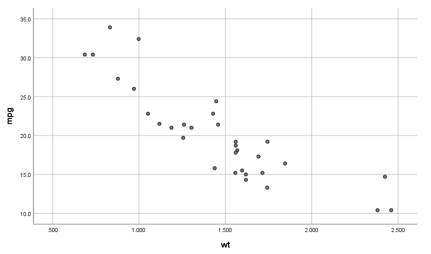
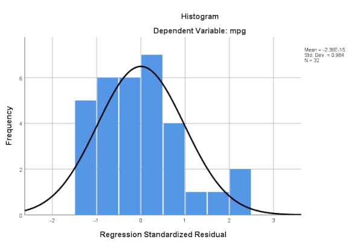

```{r, echo = FALSE}
library(knitr);
opts_chunk$set(echo = FALSE);
```


# Example regression analysis in SPSS

Example from the 1974 cars data set to predict fuel efficiency in miles per gallon (mpg) of cars given their mass (wt) in kilograms.

- Our **response** or **dependent** variable is miles per gallon
- Our **predictor** or **independent** variable is car mass

Before fitting our regression model, we should check our assumptions of linear regression.

# Checking assumptions of linear regression

1. **The independent variable X is measured without error.** Independent variable (car mass) should be fixed (i.e., measured without error). 
2. **The relationship between X and Y is linear.** We can check in SPSS; select 'Graph > Legacy Dialogs > Scatter/Dot', then select 'Simple Scatter' from the available options.
3. **For any value of X, Y is normally distributed.** Values of the dependent variable, miles per gallon, should be normally distributed. We can check this in SPSS using 'Analyse > Descriptive Statistics > Explore', then putting 'mpg' in the Dependent List. 
4. **For all values of X, the variance of the residuals is identical**. We can check by plotting the data in SPSS in the same scatter plot that we used to check that the relationship was linear.


# Checking assumptions of linear regression




# Fitting the linear regression model

'Analyse > Regression > Linear'


Every regression model in SPSS will produce four tables (we can ignore the first for now).


# Linear regression: Model summary output


# Linear regression: ANOVA output


# Linear regression: Coefficients output


# Assumption of normally distributed residuals

Next, we can look at the output of the residual diagnostics to check our assumption that the residuals are normally distributed. 

We can see the Histogram showing the Regression Standardised Residual output.


# Assumption of normally distributed residuals




# Conclusions of our regression model


