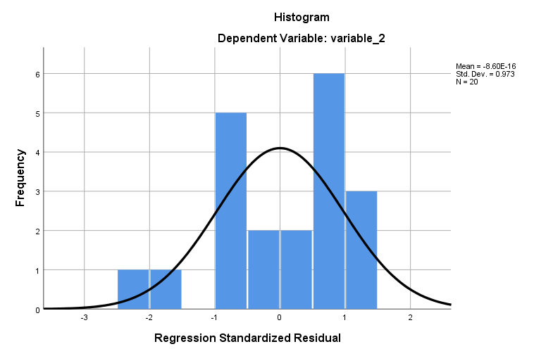

```{r, echo = FALSE}
library(knitr);
opts_chunk$set(echo = FALSE);
```


# Introduction to regression

In regression, our objective is to understand some dependent variable Y based on an independent variable X. Regression is a tool for predicting the value of Y as a function of X. We can use this tool to do the following,

- Support hypotheses of causation of changes in y values due to changes in x values
- Predict y values as a function of x values
- To explain the variation of y values using x values

Regression analysis can be used to support causal hypotheses, but it **cannot, by itself be used to determine causality**.


# Visualising a regression of y values against x values


```{r, echo = FALSE, message = FALSE, warning = FALSE, fig.cap = "A regression of one dependent variable y against the independent variable x."}
X1 <- c(2.02, 8.6, 4.9, 1.5, 2.8, 4.6, 7.5, 6.2, 3.3, 5.6);
Y1 <- c(5, 3, 6, 1.3, 5.5, 3.1, 5.2, 6.8, 3.6, 6.6);
B0 <- as.numeric(lm(Y1~X1)$coefficients[1]);
B1 <- as.numeric(lm(Y1~X1)$coefficients[2]);
resi <- lm(Y1~X1)$residuals;
mxrs <- which(X1 == max(X1));
plot(x = X1, y = Y1, pch = 20, xlab = "Independent Variable X", cex = 1.5, 
     xlim = c(0, 10), ylim = c(0, 10), cex.lab = 1.25, cex.axis = 1.25,
     ylab = "Dependent Variable Y", yaxs = "i", xaxs = "i");
abline(a = B0, b = B1, lwd = 2);
```


# Regression includes independent and dependent variables

**It is critical to correctly distinguish between the independent and dependent variables**.

- Independent variable (X) is free to vary
- Dependent variable (Y) is predicted to change given a change in the independent variable
- Different results will be obtained if the two variables are confused

In an experiment, the independent variable is something that we as researchers have control over (e.g., amount of fertiliser to put down on a field), whereas the dependent variable is something that we would measure when collecting our data (e.g., total crop yield of the field). 


# Regression line

The line of best fit in a regression can be described mathematically with a simple equation,

$$y = a + bx.$$

This equation includes the variables *x* and *y*, and two coefficients

- *a* is the **intercept**; the value of y that is predicted when x = 0
- *b* is the **slope**; how much y changes for a change one unit of x

Note that data points rarely will sit right on the regression line. The **residual** is defined by the difference between the measured value of y (i.e., the data point) and the y value predicted by the regression line (i.e., the vertical distance between the data point and the line).


# Regression line

```{r, echo = FALSE, message = FALSE, warning = FALSE, fig.cap = "A regression of one dependent variable y against the independent variable x."}
X1 <- c(2.02, 8.6, 4.9, 1.5, 2.8, 4.6, 7.5, 6.2, 3.3, 5.6);
Y1 <- c(5, 3, 6, 1.3, 5.5, 3.1, 5.2, 6.8, 3.6, 6.6);
B0 <- as.numeric(lm(Y1~X1)$coefficients[1]);
B1 <- as.numeric(lm(Y1~X1)$coefficients[2]);
resi <- lm(Y1~X1)$residuals;
mxrs <- which(X1 == max(X1));
plot(x = X1, y = Y1, pch = 20, xlab = "Independent Variable X", cex = 1.5, 
     xlim = c(0, 10), ylim = c(0, 10), cex.lab = 1.25, cex.axis = 1.25,
     ylab = "Dependent Variable Y", yaxs = "i", xaxs = "i");
abline(a = B0, b = B1, lwd = 2);
points(x = c(X1[mxrs], X1[mxrs]), y = c(Y1[mxrs], B0 + B1*X1[mxrs]), type = "l",
       col = "red", lwd = 1, lty = "dotted");
text(x = X1[mxrs] - 2, y = mean(c(Y1[mxrs], B0 + B1*X1[mxrs])) - 1, col = "red",
     cex = 1.5, labels = "Residual");
text(x = 4, y = B0 + (4 * B1) + 0.4, srt = 8, labels = "Slope (b)", 
     col = "blue", cex = 1.5);
text(x = 1.9, y = 2.1, cex = 1.5, "Intercept (a)", col = "orange");
arrows(x0 = 0.7, x1 = 0, y0 = 2.6, y1 = B0, lwd = 2, length = 0.1, 
       col = "orange");
arrows(x0 = 7.6, x1 = 8.6, y0 = 3.25, y1 = 4, lwd = 2, length = 0.1, 
       col = "red");
text(x = 1.5, y = 9, labels = "y = a + bx", cex = 1.5);
```


# How do we decide what is the best fit line?

Now we can turn to how we calculate where the regression line should be through our data.

- How do we know what our intercept (a) and slope (b) should be?
- Use the method of **least squares regression**
- Minimise the sum of squares of all the residual values


To get an intuitive sense for how the regression line minimises the sum of squares, use **[[this interactive application](https://bradduthie.shinyapps.io/regr_click/)]** to adjust the slope and intercept to try to find the line of best fit (it will turn blue when you succeed).


# Assumptions of regression


Regression is a widely used, but also often misused, statistical technique. It is important to be aware of the assumptions underlying linear regression.

1. **The independent variable X is measured without error**
2. **The relationship between X and Y is linear**
3. **For any value of X, Y is normally distributed**
4. **For all values of X, the variance of the residuals is identical**

Note that even if our assumptions are not perfectly met (indeed, they rarely if ever will be), this does not completely invalidate the method of linear regression. But large violations of one or more of these assumptions might indeed be problematic.

# Assumptions of regression

```{r, echo = FALSE, message = FALSE, warning = FALSE, fig.cap = "A regression of one dependent variable y against the independent variable x in which there is clear heteroscedasticity."}
X1 <- runif(n = 48, min = 0, max = 10);
Y1 <- 25 + X1 * rnorm(n = length(X1), mean = 0, 
                     sd = seq(from = 0, to = 2, length.out = length(X1)));
B0 <- as.numeric(lm(Y1~X1)$coefficients[1]);
B1 <- as.numeric(lm(Y1~X1)$coefficients[2]);
plot(x = X1, y = Y1, pch = 20, xlab = "Independent Variable X", cex = 1.5, 
     cex.lab = 1.25, cex.axis = 1.25,
     ylab = "Dependent Variable Y");
abline(a = B0, b = B1, lwd = 2);
```


# Assumptions of regression

