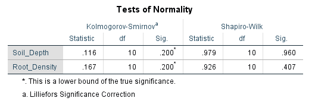

```{r, echo = FALSE}
library(knitr);
opts_chunk$set(echo = FALSE);
```


# Testing whether or not a correlation is significant

**Null Hypothesis**: There is no correlation between two variables X and Y

**Alternative Hypothesis**: There is a correlation between two variables X and Y

**Degrees of Freedom**: Number of data points minus two (lose a degree of freedom for calculating each mean)

To test whether or not to reject the null hypothesis, we can obtain a p-value in SPSS or use a table of critical values to look up the value of *r* for a specific degrees of freedom


# Testing whether or not a correlation is significant

We often want to test whether or not the correlation between two variables is significant

- Test of Pearson product moment correlation assumes variables are normally distributed
- Test of Spearman's rank correlation coefficient (i.e., correlation of ranks) does not assume normality

To test whether or not two variables are correlated, we first must test the null hypothesis that the two variables are normally distributed.


# A data set of soil depths and root densities

```{r, echo = FALSE}
library(knitr);
sample_n     <- 1:10;
soil_depth   <- c(0.8, 2, 2.3, 2.7, 0.5, 1.8, 1.5, 2.1, 1.2, 1.1);
root_density <- c(13, 8, 4, 6, 18, 7, 9, 3, 7, 10);
dat_root     <- cbind(sample_n, soil_depth, root_density);
colnames(dat_root) <- c("Sample number", "Soil depth (m)", 
                        paste("Root density (g per m^3)"));
kable(dat_root);
```

In the above table, soil depth is measured in metres and root density is measured in grams per cubic metre.


# Testing for normality in SPSS

Select 'Analyse > Descriptive Statistics > Explore', the move both variables to the Dependent list, click 'Plots' and make sure to select 'Normality plots with tests' as below


# Testing for normality in SPSS

Below shows the output of the tests for normality in SPSS (try to recreate these for yourself).




# Plotting soil depth versus root density in SPSS

How to make a scatterplot in SPSS

- Select 'Graph > Legacy Dialogues > Scatter/Dot' 
- A small box should pop up, and we can select 'Simple Scatter', 
- Click 'Define'. 
- Select 'Soil_Depth' for the x axis and 'Root_Density' for the y-axis
- Click 'OK'.


# Plotting soil depth versus root density in SPSS


# Testing whether soil depth and root density are correlated


Test whether or not our variables 'soil_depth' and 'root_density' are correlated.

**Hypothesis for Pearson's correlation coefficient**

- **Null:** There is no correlation between root density and soil depth
- **Alternative:** There is a significant correlation between root density and soil depth

We will reject the null hypothesis if, assuming that the null hypothesis is true, the probability of getting an *r* value as or more extreme than the one we obtained from our sample (i.e., the p-value) is less than or equal to 0.05.

# Testing whether soil depth and root density are correlated

Test the null hypothesis that this correlation is not significant in SPSS

- Selecting 'Analyse > Correlate > Bivariate Correlation' 
- Move both variables into the 'Variables' box
- Make sure 'Pearson' selected for Correlation Coefficients
- Use a two-tailed test for statistical significance
- Ignore the 'Flag significant correlations' (does not matter)


# Testing whether soil depth and root density are correlated


# Testing whether soil depth and root density are correlated


A table of output that looks like the one below.


# Spearman rank correlation coefficient

If either variable is not normally distributed, we need a non-parametric test

- The Spearman rank correlation coefficient is a non-parametric alternative. 
- Calculate the correlation of the **ranks** of the values 
- Test whether this Spearman rank correlation coefficient is significant

Consider some measurements of per cent dissolved oxygen and ammonia concentration (in mg per litre) from eight locations in Scotland. 

# Spearman rank correlation coefficient

```{r, echo = FALSE, message = FALSE, warning = FALSE}
samp_number  <- 1:8;
percent_O2   <- c(95.9, 81.9, 80.9, 77.9, 90.7, 88.2, 93.6, 89.1);
ammonia      <- c(0.08, 0.10, 0.21, 0.37, 0.25, 0.13, 0.07, 0.121);
rank_pct_O2  <- rank(percent_O2);
rank_ammonia <- rank(ammonia);
dat_spear    <- data.frame(samp_number, percent_O2, rank_pct_O2, ammonia,
                           rank_ammonia);
colnames(dat_spear) <- c("Sample", "%O2", "Rank %O2", "NH3 Conc.", "Rank NH3 Conc.");
kable(dat_spear);
```


# Testing whether per cent O2 and Ammonia are correlated


Test whether or not our variables per cent O2 and Ammonia concentration are correlated.

**Hypothesis for Spearman's correlation coefficient**

- **Null:** There is no correlation between per cent dissolved oxygen and ammonia concentration
- **Alternative:** There is a significant correlation between per cent dissolved oxygen and ammonia concentration

We will reject the null hypothesis if, assuming that the null hypothesis is true, the probability of getting an *r* value as or more extreme than the one we obtained from our sample (i.e., the p-value) is less than or equal to 0.05.

# Testing whether per cent O2 and Ammonia are correlated


# Testing whether per cent O2 and Ammonia are correlated


Spearman rank correlation coefficient between the variables per cent dissolved oxygen and ammonia concentration is -0.667, and the p-value for this test is 0.071, meaning that we cannot reject our null hypothesis that the two variables are uncorrelated.


